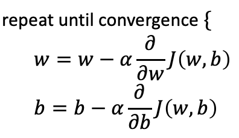

## Practice quiz: Train the model with gradient descent

 

### Question 1

Gradient descent is an algorithm for finding values of parameters w and b that minimize the cost function J.

<figure>
   
</figure>

When $\frac{\partial J(w,b)}{\partial w}$ is a negative number (less than zero), what happens to $w$ after one update step?

- $w$ decreases
- **$w$ increases**
- $w$ stays the same
- It is not possible to tell if $w$ will increase or decrease

> The learning rate is always a positive number, so if you take W minus a negative number, you end up with a new value for W that is larger (more positive).

### Question 2

For linear regression, what is the update step for parameter b?

- **$b = b - \alpha \frac{1}{m} \sum_{i=1}^{m}(f_{w,b}(x^{(i)})-y^{(i)})$**
- $b = b - \alpha \frac{1}{m} \sum_{i=1}^{m}(f_{w,b}(x^{(i)})-y^{(i)})x^{(i)}$

> The update step is $b=b-\alpha\frac{\partial J(w,b)}{\partial w} where \frac{\partial J(w,b)}{\partial w}$ can be computed with this expression: $\sum_{i=1}^{m}(f_{w,b}(x^{(i)})-y^{(i)})$
