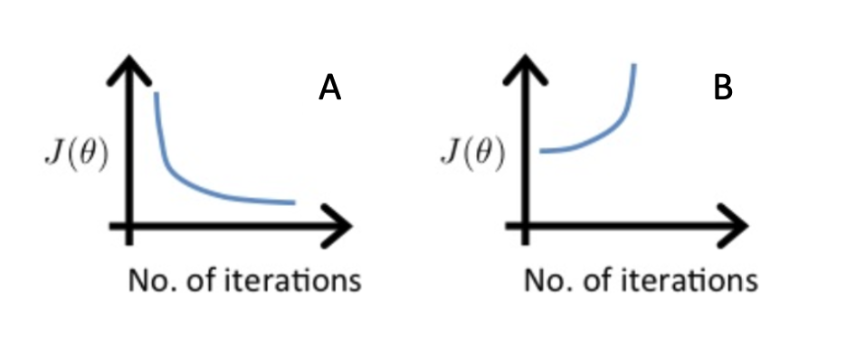

## Practice quiz: Gradient descent in practice

### Question 1

<figure>
    
<figure>

Which of the following is a valid step used during feature scaling?

- **Subtract the mean (average) from each value and then divide by the (max-min).**
- Add the mean (average) from each value and then divide by the (max-min).

> This is called mean normalization.

### Question 2

Suppose a friend rand gradient descent three seperate times with three chocices of th learning rate $\alpha$ and plotted the learning curves for each (cost J for each iteration).

<figure>
    
<figure>

For which case, A or B, was the learning rate $\alpha$ likely too large?

- Neither Case A nor B
- Both Cases A and B
- case A only
- **case B only**

> The cost is increasing as training continues, which likely indicates that the learning rate alpha is too large.

### Question 3

Of the circumstances below, for which one is feature scaling particularly helpful?

- **Feature scaling is helpful when one feature is much large (or smaller) than another feature.**
- Feature scaling is helpful when all the features in the original data (before scaling is applied) range from 0 to 1.

> For example, the "house size" in square feet may be as high as 2000, which is much larger than the feature "number of bedrooms" having a valude between 1 and 5 for most houses in the modern era.

### Quesiton 4

You are helping a grocery store predict its revenue, and have data on its items sold per week, and price per item. What could be a useful engineered feature?

- **For each product, calculate the number of items sold times price per item.**
- For each product, calculate the number of items sold divided by the price per item.

> This feature can be interpreted as the revenue generated for each product.

### Question 5

True/False? With polynomial regression, the predicted values of $f_{w,b}(x)$ does not necessarily have to be a straight line (or linear) function of the input feature x.

- False
- **True**

> A polynomial function can be non-linear. This can potentially help the model to fit the training data better.
