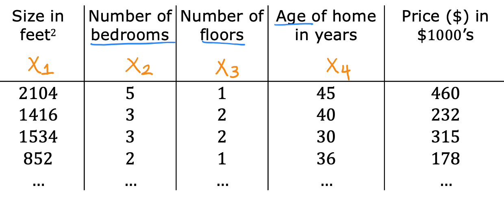

## Practice quiz: Multiple linear regression

### Question 1

In the training set below, what is $x^{(3)}_{4}$? Please type in the number below (this is an integer such as 123, no decimal points)

<figure>
   
</figure>

> Yes! $x^{(3)}_{4}$ is the 4th feature (4th column in the table) of the 3rd training example (3rd row in the table)

### Question 2

Which of the following are potential benefits of vectorization? Please choose the best option.

- It makes your code run faster
- It can make your code shorter
- It allows your code to run more easily on parallel compute hardware
- **All of the above**

> Correct! All of these are benefits of vectorization

### Question 3

True/False? To make gradient descent converge about twice as fast, a technique that almost always works is to double the learning rate $alpha$.

- True
- **False**

> Doubling the learning rate may result in a learning rate that is too large, and cause gradient descent to fail to find the optimal values for the paramter $w$ and $b$
