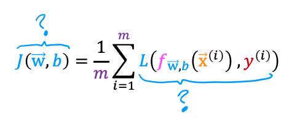

## Practice quiz: Cost function for logistic regression

### Question 1

<figure>
    
<figure>

In this lecture series, "cost" and "loss" have distinct meanings. Which one applies to a single training example?

- **Loss**
- Cost
- Both Loss and Cost
- Neither Loss nor Cost

> In these lectures, loss is calculated on a single training example. It is worth noting that this definition is not universal. Other lecure sries may have a different definition.

### Question 2

For the simplified loss function, if the label $y^{(i)} = 0$, then what does this expression simplify to?

- $log(f_{\vec{w},b}(X^{(i)})$
- $log(1-f_{\vec{w},b}(x^{(i)}))$ + $log(1-(f_{\vec{w},b}(X^{(i)}))$
- **$-log(1-(f_{\vec{w},b}(X^{(i)}))$**
- $-log(1-(f_{\vec{w},b}(X^{(i)})) - log(1-(f_{\vec{w},b}(X^{(i)}))$

> When $y^{(i)}, the first term reduces to zero.$
