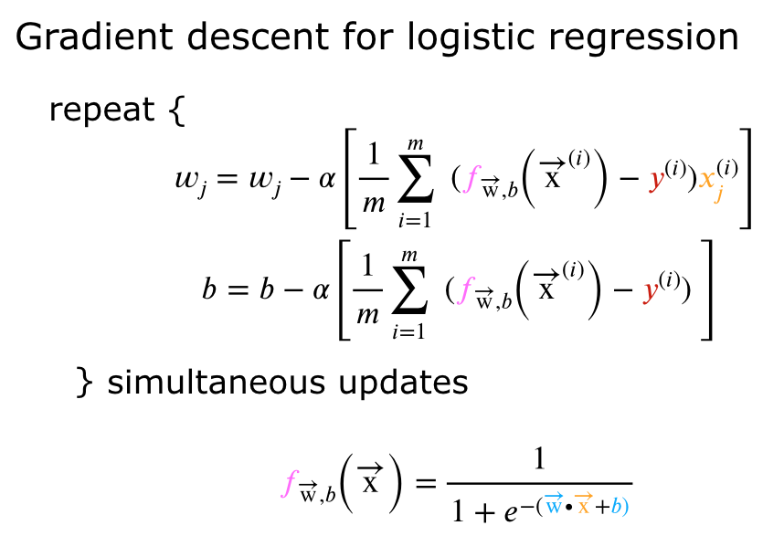

## Practice quiz: Gradient descent for logistic regression

### Question 1

<figure>
    
<figure>

Which of the following two statements is a more accurate statement about gradient descent for logistic regression?

- The update steps are identical to the update steps for linear regression.
- **The update steps look like the update steps for linear regression, but the definition of $f_{\vec{w},b}(X^{(i)})$ is different.**

> For logistic regression, $f_{\vec{w},b}(X^{(i)})$ is the sigmoid function instead of straight line.
