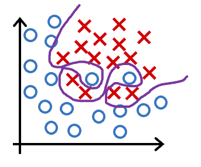
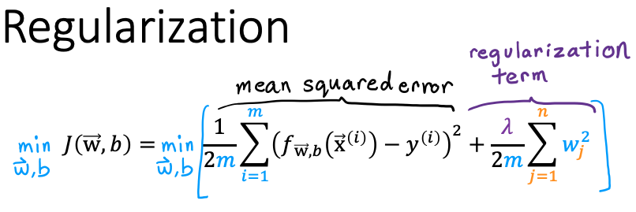

## Practice quiz: The problem of overfitting

### Question 1

Which of the following can address overfitting?

- Remove a random set of training examples
- **Apply regularization**

> Regularization is used to reduce overfitting

- **Collect more training data**

> If the model trains on more dta, it may generalize better to new examples.

- **Select a subset of the more relevant features**.

> If the model trains on the more relevant features, and not on the less useful features, it may generalize better to new examples.

### Question 2

You fit logistic regresssion with polynomial features to a dataset and your model looks like this.

<figure>
    
</figure>

What would you conclude? (Pick one)

- The model has high bias (underfit). Thus, adding data is likely to help
- The model has high variance (overfit). Thus, adding data is, by itself, unlikely to help much.
- **The model has high variance (overfit). Thus, adding data is likely to help**
- The model has high bias (underfit). Thus, adding data is, by itself, unlikely to help much.

> The model has high variance (it overfits the training data). Adding data (more training examples) can help.

### Question 3

<figure>
    
</figure>

Suppose you have a regularized linear regression model. If you increase the regularization parameter $\lambda$, what do you expect to happen to the parameters $w_{1}, w_{2}, ..., w_{n}$?

- This will reduce the size of the parameters $w_{1}, w_{2}, ..., w_{n}$
- This will increase the size of the parameters $w_{1}, w_{2}, ..., w_{n}$

> Regularization reduces overfitting by reducing the size of the parameters $w_{1}, w_{2}, ..., w_{n}$
