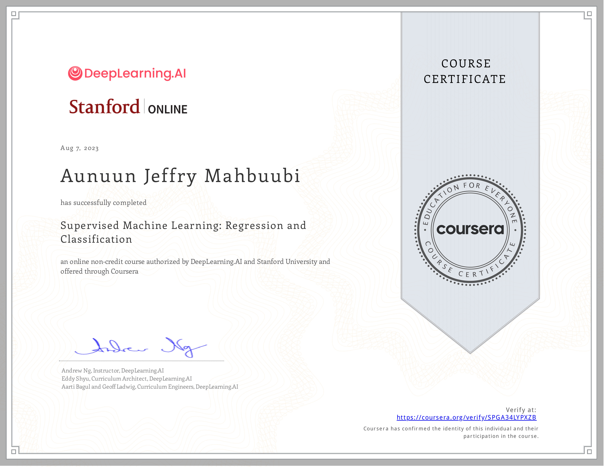

## [Superviszed Machine Learning: Regression and Classification](https://www.coursera.org/learn/machine-learning?specialization=machine-learning-introduction)

### What you will learn

- Build machine learning models in Python using popular machine learning libraries NumPy & scikit-learn
- Build & train supervised machine learning models for prediction & binary classification tasks, including linear regression & logistic regression

### Skills you will gain

- Regularization to Avoid Overfitting
- Gradient Descent
- Supervised Learning
- Linear Regression
- Logistic Regression for Classification
