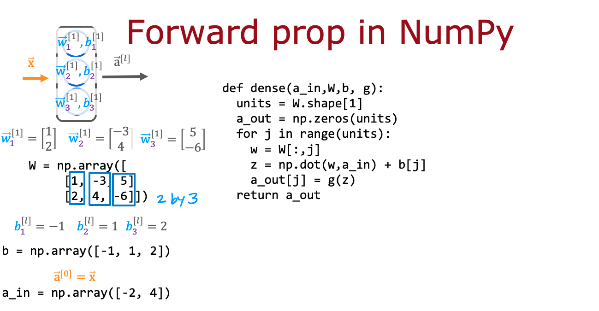

## Practice quiz: Neural network implementation in Python

### Question 1

According to the lecture, how do you calculate the activation of the third neuron in the first layer using NumPy?

- layer_1 = Dense(units=3, activation='sigmoid')
  a_1 = layer_1(x)

- z1_3 = w1_3 \* x + b
  a1_3 = sigmoid(z1_3)

- **z1_3 = np.dot(w1_3,x) + b1_3**
  **a1_3 = sigmoid(z1_3)**

> Correct. Use the numpy.dot function to take the dot product. The sigmoid function shown in lecture can be a function that you write ourself (see course 1, wee 3 of the specialization), and that will be provided to you in this course.

### Question 2

According to the lecture, when coding up the numpy array W, where would you place the w parameters for each neuron?

- In the rows of W.
- **In the columns of W.**

> Correct. The w parameters of neuron 1 are in column 1. The w parameters of neuron 2 are in column 2, and so on.

### Question 3

For the code above in the "dense" function that defines a single layer of neurons, how many times does the code go through the "for loop"? Note that W has 2 rows and 3 columns.

- 2 times
- 5 times
- 6 times
- **3 times**

> Yes! For each neuron in the layer, there is one column in the numpy array W. The for loop calculates the activation value for each neuron. So if there are 3 columns in W, there are 3 neurons in the dense layer, and therefore the for loop goes through 3 iterations (one for each neuron.)
