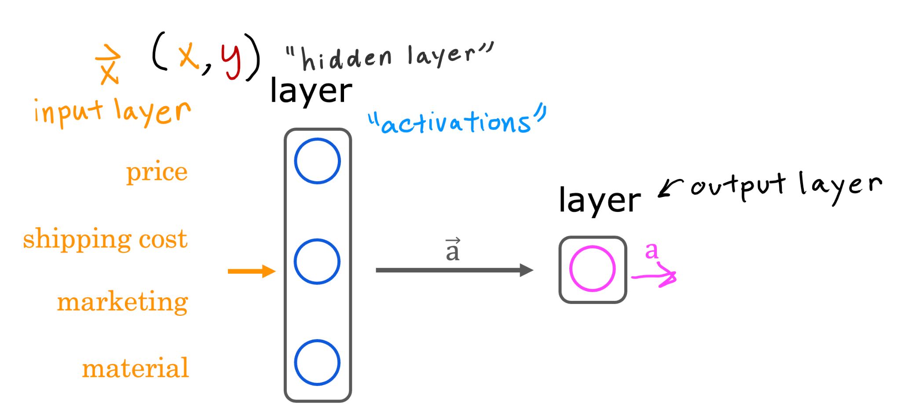

## Practice quiz: Neural networks intuition

### Question 1

Which of these terms used to refer to components of an artificial neural network? (hint: three of these are correct)

- **layers**

> Yes, a layer is a grouping of neurons in a neural network

- **activation function**

> Yes, an activation is the number calculated by a neuron (and "activations" in the figure above is a vector that is output by a layer that contains multiple neurons)

- **neurons**

> Yes, a neuron is a part of a neural network

- axon

### Quesiton 2

True/False? Neural networks take inspiration from, but do not very accurately mimic, how neurons in a biological brain learn.

- False
- **True**

> Artifical neural networks use a very simplified mathematical model of what a biological neuron does.
