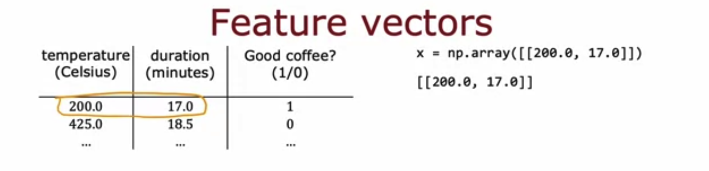

## Practice quiz: TensorFlow implementation

### Question 1

For the following code:

```python
model = Sequential([
    Dense(units=25, activation="sigmoid"),
    Dense(units=15, activation="sigmoid"),
    Dense(units=10, activation="sigmoid"),
    Dense(units=1, activation="sigmoid")
])
```

This code will define a neural network how many layers?

- 5
- **4**
- 25
- 3

> Yes! Each call to the "Dense" function defines a layer of theneural network.

### Question 2


How do you define the second layer of a neural network that has 4 neurons and a sigmoid activation?

- Dense(layer=2, units=4, activation="sigmoid")
- **Dense(units=4, activation="sigmoid")**
- Dense(units=4)
- Dense(units=[4], activation=['sigmoid])

> Yes! This will have 4 neurons and a sigmoid activation.

### Question 3



If the input features are temperature (in celcius) and duration (in minutes), how do you write the code for the first feature vector `x` shown above?

- x = np.array([[200.0],[17.0]])
- x = np.array([['200.0', 17.0]])
- x = np.array([[200.0 + 17.0]])
- **x = np.array([[200.0, 17.0]])**

> Yes! A row contains all the features of a training example. Each column is a feature.
