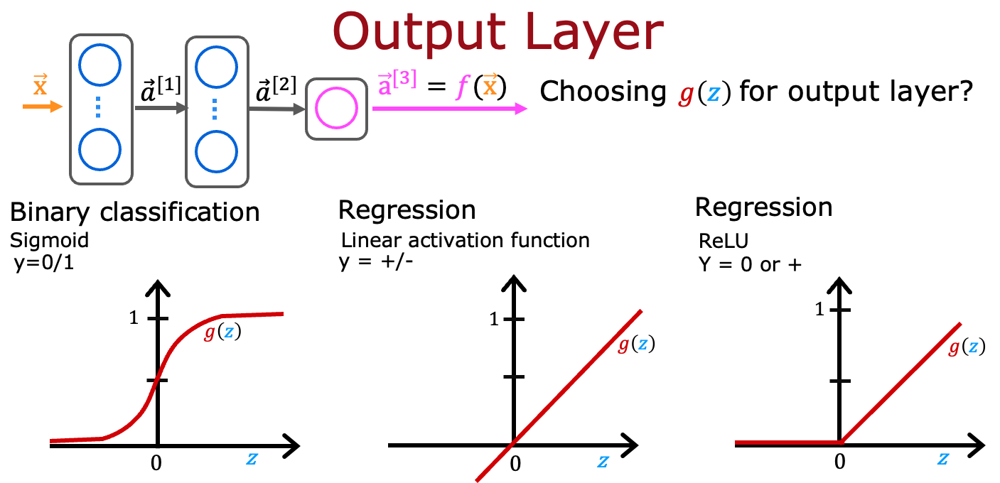

## Practice quiz: Activation Functions

### Question 1

Which of the following activation functions is the most common choice for the hidden layers of a neural network?

- Most hidden layers do not use any activation function
- Sigmoid
- **ReLu (rectified linear unit)**
- Linear

> Yes! A ReLU is most often used because it is faster to train compared to the sigmoid. This is because the ReLU is only flat on one side (the left side) whereas the sigmoid goes flat (horizontal, slope approaching zero) on both sides of the curve.

### Question 2

For the task of predicting housing prices, which activation functions could you choose for the output layer? Choose the 2 options that apply.

- **linear**

> Yes! A linear activation function can be used for a regresiont ask where the otuptu can be both negative and positive, but it's also possible to use it for task where the output is 0 or greater (like with house prices)

- **ReLU**

> Yes! eLU outputs values 0 or greater, and housing are positive values.

- Sigmoid

### Question 3

True/False? A neural netwok with many layers but no activation function (in the hidden layers) is not effective; that's why we should instead use the linear activation function in every hidden layer.

- True
- **False**

> Yes! A neural network with many layers but no activation function is not effectie. A linear activation is the same as "no activation function".
