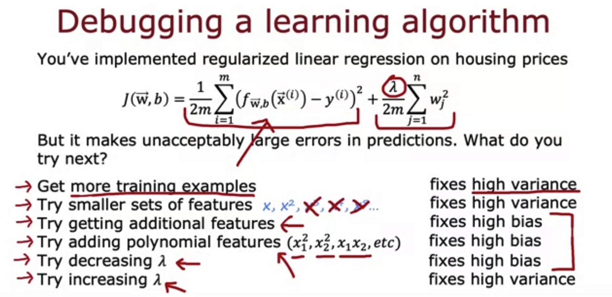

## Practice quiz: Bias and variance

### Question 1

If the model's cross validation error $J_{cv}$ is much higher than the training error $J_{train}$, this is an indication tha the model has

- Low variance
- Low bias
- **High variance**
- High bias

> When $J_{cv} >> J_{train}$ (whether $J_{train}$ is also high or not, this is a sign that the model is overfitting to the training data and performing much worcse on new examples.)

### Question 2

Which of these is the best way to determine whther your model has high bias (has underfit the training data)?

- Compare the training error to the cross validation error.
- See if the cross validation error is high compared to the baseline level of performance
- See if the training error is high (above 15% or so)
- **Compare the training error to the baseline level of performance**

> Correct. If comparing your model's training error to a baseline level of performance (such as human level performance, or perfromance of other well-established models), if your model's training error is much higher, the this is a sign that the model has high bias (has underfit).

### Question 3

You find that your algorithm has high bias. Which of these seem like good options for improving the algorithm's performance? Hint: two of these are correct

- Remove examples from training set
- **Collect additional features or add polynomial features**

> Correct. More freatures could potentially help the model better fit the training examples.

- **Decrease the regularization paramater $\lambda$(lambda) (since regularization tends to make the model simpler)**

> Correct. Decreasing regularization can help the model better fit the training data.

- Collect more training examples

### Question 4

You find that your algorithm has a training error of 2%, and a cross validatoin error of 20% (much higher than the training error). Based on the conclusion you would draw about whether the algorithm has a high bias or high variance problem, which of these seem like good options for improving the algorithm's performance? Hint: two of these are correct.

- Decrease the regularization parameter $\lambda$
- **Collect more training data**

> Yes, the model appears to have high variance (overfit), and collecting more training examples would help reduce high variance

- Reduce the training set size

- **Increase the regularization paramater $\lambda$**

> Yes, the model appears to have high variance (overfit), and increasing regularization would help reduce high variance.
