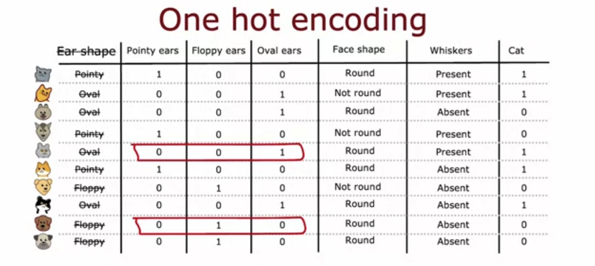

## Practice quiz: Decision tree learning

### Question 1

Recall that entropy was defined in lecture as H(p_1) = -p_1 log_2(p_1) - p_0 log_2(p_0), where p_1 is the fraction of the positive examples and p_0 the fraction of negative examples.

At a given node of a decision tree, 6 of 10 examples are cats and 4 of 10 are cnot cats. Which expression calculates the entropy H(p1) of this group of 10 animals?

- $-(0.6)log_{2} - (1 - 0.4)log_{2}(1-0.4)$
- $(0.6)log_{2}(0.6) + (1-0.4)log_{2}(1-0.4)$
- $(0.6)log_{2}(0.6) + (0.4)log_{2}(0.4)$
- $-(0.6)log_{2}(0.6) - (0.4)log_{2}(0.4)$ - ANSWER

> Correct. The expression is $-(p_{1})log_{2}(p_{1})-(p_{0})log_{2}(p_{0})$

### Question 2

Recall that information was defined as follows:

$H(p_{1}^{root})-(w^{left}H(p_{1}^{left})+w^{right}H(p^{right}_{1}))$

Before a split, the entropy of a group 5 cats and 5 non-cats is H(5/10). After splitting on a particular feature, a group of 7 animals (4 of which are cats) has an entropy of H(4/7). The other group of 3 animals (1 is a cat) and has an entropy of H(1/3). What is the expression for information gain?

- $H(0.5)-(H(4/7)+H(1/3))$
- $H(0.5)-(\frac{4}{7}*H(\frac{4}{7})+\frac{4}{7}*H(\frac{1}{3}))$
- $H(0.5)-(7*H(\frac{4}{7})+3*H(\frac{1}{3}))$
- $H(0.5)-(\frac{7}{10}H(\frac{4}{7})+\frac{3}{10}H(\frac{1}{3}))$ - ANSWER

> Correct. The general expression is $H(p_{1}^{root})-(w^{left}H(p_{1}^{left})+w^{right}H(p_{1}^{right}))$

### Quesiton 3

To represent 3 possible values for the ear shape, you can define 3 features for ear shape: pointy ears, floppy ears, oval ears. For an animal whose ears are not pointy, not floppy, but are oval, how can you represent this information as a feature vector?

- **[0,0,1]**
- [1,0,0]
- [0,1,0]
- [1,1,0]

> Yes! 0 is used to represent the absence of that feature (not pointy, not floppy), and 1 is used to represent the presence of that feature (oval)

### Question 4

For a continuous valued feature (such as weight of the animal), there are 10 animals in the dataset. According to the lecture, what is the recommended way to find the best split for that feature?

- **Choose the 9 mid-points between the 10 examples as possible splits, and find the split that gives the highest information gain.**
- Try every value spaced at regular intervals (e.g., 8,8.5,9,9.5,10,etc) and find the split that gives the highest information gain.
- Use a one-hot encoding to turn the feature into a discrete feature vector of 0's and 1's, then apply the algorithm  we had discussed for discrete features.
- Use gradient descent to find the value of the split threshold that gives the highest information gain.

> Correct. This is what is proposed in lectures.

### Question 5

Which of these are commonly used criteria to decide to stop splitting? (Choose two)

- **When the number of examples in a node is below threshold**

> Yes!

- When the information gain from additional splits is too large
- **When the tree has reached a maximum depth**

> Yes!

- When a node is 50% one class and 50% another class (highest possible value of entropy)

