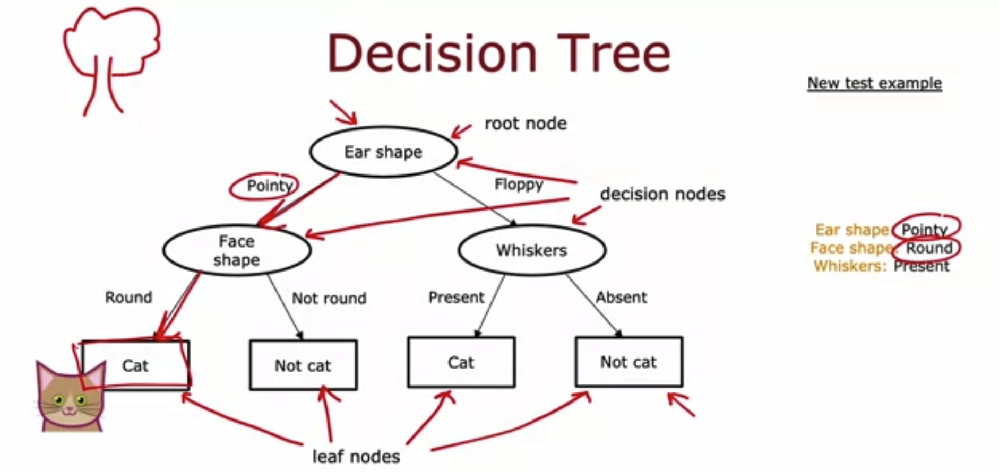
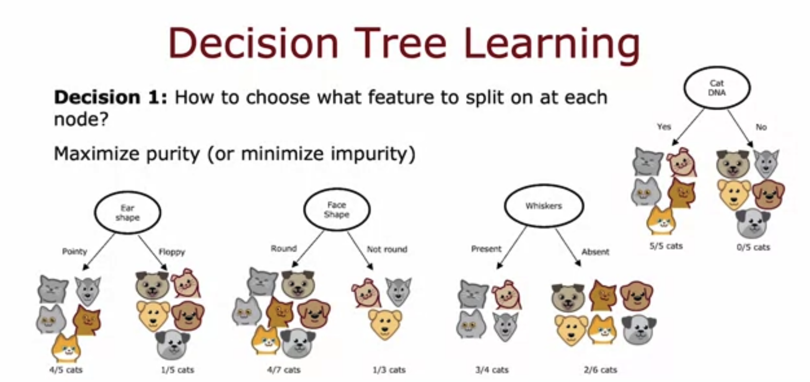

## Practice quiz: Decision trees

### Question 1

Based on the decision tree shown in the lecture, if an animal has floppy ears, a raound face shape and has whiskers, does the model predict that it's a cat or not a a cat?

- Not a cat
- Cat

> Correct. If you follow the floppy ears to the right, and then from the whisckers decision node, go left because whiskers are present, you reach a leaf node for "cat", so the model would predict that this is a cat.

### Quesiton 2

Take a decision tree learning to classify between spam non-spam email. There are are 20 training examples at the root note, comprising 10 spam and 10 non-spam emails. If the algorithm can choose from among four features, resulting in four corresponding splits, which would it choose (i,e., which has highest purity)?

- Left split: 10 of 10 emails are spam. Right split: 0 of 10 emails are spam.
- Left split: 2 0f 2 emails are spam. Right split: 8 of 18 emails are spam.
- Left split: 5 of 10 emails are spam. Right split: 5 of 10 emails are spam.
- Left split: 7 of 8 emails are spam. Right split: 3 of 12 emails are spam.

> Yes!