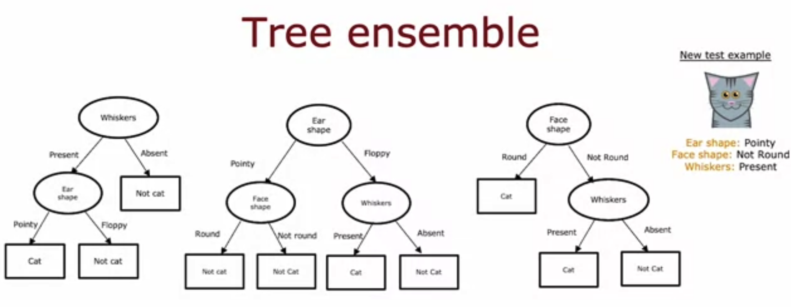

## Practice quiz: Tree ensembles

### Question 1

For the random forest, how do you vuild each individual tree so that they are not all identical to each other?

- Train the algorithm multiple times on the same training set. This will naturally result in different trees.
- If you are training B trees, train each one on 1/B of the training set, so each tree is trained on a distinct set of examples.
- **A: Sample the training data with replacement and select a random subset of features to build each tree**
- Sample the training data without replacement.

> Correct. You can generate a training set that is unique for each individual tree by sampling the training data with replacement. The random forest algorithm further avoids identical trees by randomly selecting a subset of features when building the tree ensemble.

### Question 2

You are choosing between a decision tree and a neural network for a classification task where the input $x$ is a 100x100 resolution image. Which would you choose?

- A decision tree, because the input is unstructured and decision trees typically work better with unstructured data.
- A neural network, because the input is structured data and neural networks typically work better with structured data.
- **A neural network, because the input is unstructured data and neural networks typically work better with unstructured data.**
- A decision tree, because the input is structured and decision trees typically work better with structured data.

> Yes!

### Question 3

What does sampling with repacement refer to?

- It refers to using a new sample of data that we use to permanently overwrite (that is, to replace) the original data.
- **Drawing a sequence of examples where, when picking the next example, first replacing all previously drawn examples into the set we are picking from.**
- Drawing a sequence of examples where, when picking the next example, first remove all previously drawn examples into the set we are picking from.
- It refers to a process of making identical copy of the training set.

> Yes!