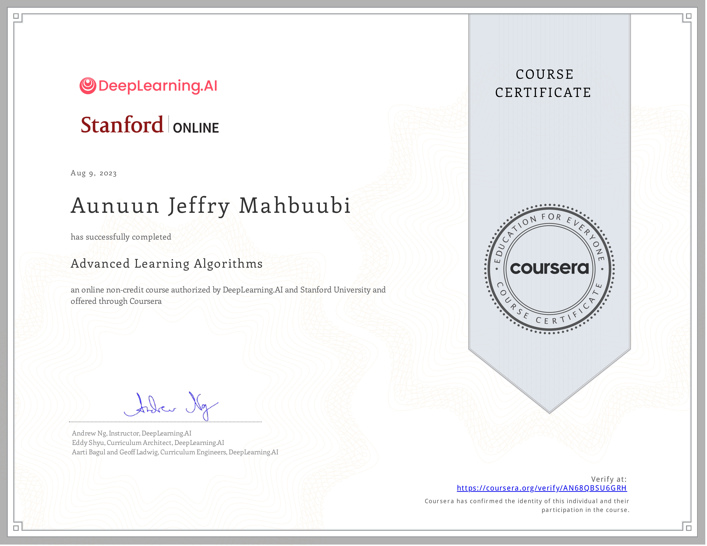

## [Advanced Learning Algorithms](https://www.coursera.org/learn/advanced-learning-algorithms?specialization=machine-learning-introduction)

### What you will learn

- Build and train a neural network with TensorFlow to perform multi-class classification
- Apply best practices for machine learning development so that your models generalize to data and tasks in the real world
- Build and use decision trees and tree ensemble methods, including random forests and boosted trees

### Skills you will gain

- Artificial Neural Network
- Xgboost
- Tensorflow
- Tree Ensembles
- Advice for Model Development
