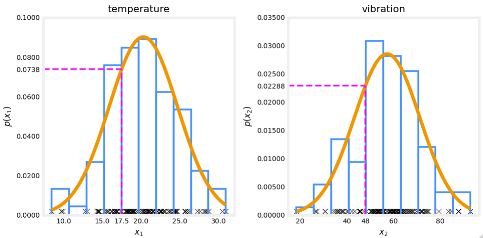

## Anomaly detection

### Question 1

You are building a system to detect if computers in a data center are malfunctioning. You have 10000 data points of computers functioning well, and no data from computers malfunctioning. What type of algorithm should you use?

- **Anomaly detection**
- Supervised learning

> Creating an anomaly detection model does not requiere labeled data.

### Question 2

You are building a system to detect if computers in a data center are malfunctioning. You have 10000 data points of computers functioning well, and 10000 data points of computers malfunctioning. What type of algorithm should you use?

- Anomaly detection
- **Supervised learning**

> You have a sufficient number of anomalous examples to build a supervised learning model.

### Question 3

Say you have 5000 examples of normal airplane engines, and 15 examples of anomalous engines. How would you use the 15 examples of anomalous engines to evaluate your anomaly detection algorithm?

- Use it during training by fitting one Gaussian model to the normal engines, and a different Gaussian model to the anomalous engines.
- **Put the data of anomalous engines (togethe with some normal engines) in the cross-validation and/or test sets to measure if the learned model can correctly detect anomalous engines.**
- You cannot evaluate an anomaly detection algroithm because it is an unsupervised learning algorithm.
- Because you have data of both normal and anomalous engines, don't use anomaly detection. Use supervised learning instead.

> Anomalous examples are used to evaluate rather than the train model.

### Question 4

Anomaly detection flags a new input $x$ as an anomaly if $p(x) < \epsilon$. If we reduce the value of $\epsilon$, what happens?

- The algorithm is more likely to classify new examples as an anomaly.
- **The algorithm is less likely to classify new examples as an anomaly.**
- The algorithm is more likely to classify some examples as an anomaly, and less likely to classify some examples as ann anomaly. It depends on the example $x$.
- The algorithm will automatically choose parameters $\mu$ and $\sigma$ to decrease $p(x)$ and compnesate

### Quesiton 5

You are monitoring the temperature and vibration intensity on newly manufactured aircraft engines. You have measured 100 engines and fit the Gaussian model described in the video lectures to the data. The 100 examples and the resulting distributions are shown in the figure shown.

The measurements on the latest engine you are testing have a temperature of 17.5 and a vibration intensity of 48. These are shown in magenta on the figure below. What is the probability of an engine having these two measurements?

- **0.0738 \* 0.02288 = 0.00169**
- 0.0738 + 0.02288 = 0.0966
- 17.5 \* 48 = 840
- 17.5 + 48 = 65.5

> According to the model described in lecture, p(A,B) = p(A) * p(B)
