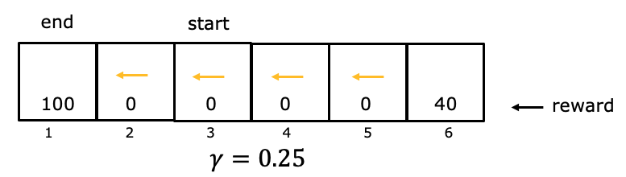

## Reinforcement learning introduction

### Question 1

You are using reinforcement learning to control a four legged robot. The position of the robot would be its ...

- reward
- **state**
- return
- action

> Great!

### Question 2

You are controlling a Mars rover. You will be very very happy if it gets to state 1 (significant scientific discovery), slightly happy if it gets to state 2 (small scientific discovery), and unhappy if it gets to state 3 (rover is permanently damaged). To reflect this, choose a reward function so that:

- R(1) < R(2) < R(3), where R(1) and R(2) are negative and R(3) is positive.
- **R(1) > R(2) > R(3), where R(1) and R(2) are positive and R(3) is negative.**
- R(1) > R(2) > R(3), where R(1), R(2) and R(3) are negative.
- R(1) > R(2) > R(3), where R(1), R(2) and R(3) are positive.

> Good Job, Based on the happiness levels described in the question, you would want the greatest reward for state 1 (significant scientific discovery), followed by a smaller reward for state 2 (small scientific discovery), and the smallest reward for state 3 (rover is permanently damaged). The correct choice would be:

### Question 3

You are using reinforcement learning to fly a helicopter. Using a discount factor of 0.75, your helicopter starts in some state and receives rewards -100 on the first step, -100 on the second step, and 1000 on the third and final step (where it has reached a terminal state). What is the return?

- -100 -0.75*100+ 0.75^2*1000 - ANSWER
- -100 -0.25*100+ 0.25^2*1000
- -0.75*100 -0.75^2*100 + 0.75^3\*1000
- -0.25*100-0.25^2*00 + 0.25^3\*1000

> Awesome! Using a discount factor of $\gamma=0.75$ the return can be calculated as: $-100-0.75\cdot{100}+0.75^{2}\cdot{1000}=-100-75+0.75^{2}\cdot{1000}=-175+0.5625\cdot{1000}=387.5$

### Question 4

Given the rewards and actions below, compute the return from state 3 with a discount factor of $\gamma=0.25$

- 0
- **6.25**
- 0.39
- 25

> If starting from state 3, the rewards are in states 3, 2, and 1. The return is $0+(0.25)\times{0}+(0.25)^{2}\times{100}=6.25$